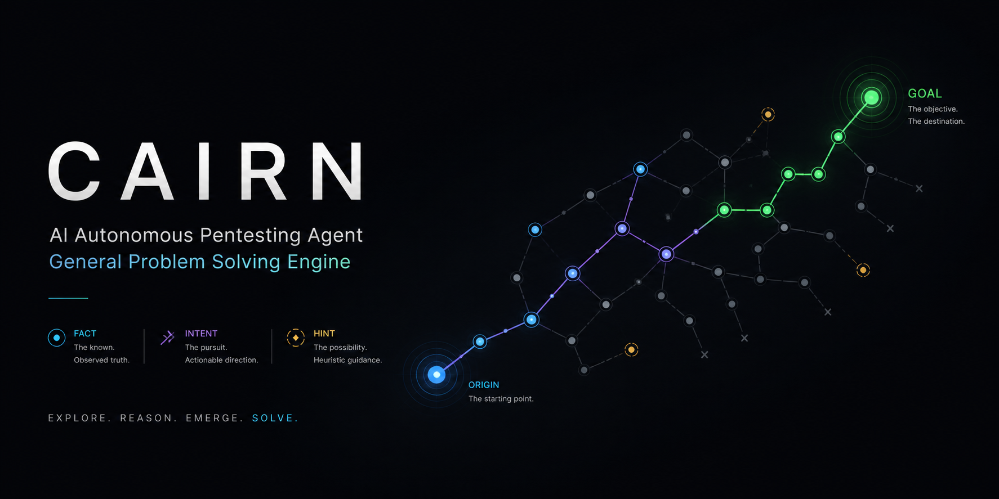
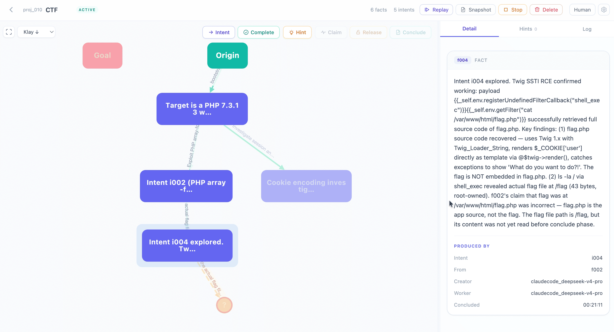

<div align="center">



# Cairn
### 不止于 AI 渗透测试 —— 迈向通用状态空间搜索

<p>
  <a href="https://zc.tencent.com/hackathon" target="_blank" rel="noopener noreferrer">
    
  </a>
  <a href="https://zc.tencent.com/hackathon" target="_blank" rel="noopener noreferrer">
    
  </a>
  <a href="https://wiki.chainreactors.red" target="_blank" rel="noopener noreferrer">
    
  </a>
</p>

Cairn 是一个通用问题求解引擎。<br/>它不定义角色，不定义工作流。给定一个起点和一个目标，它会在未知的状态空间中搜索出一条路径。<br/>AI 渗透测试正是这样一类问题 —— 并且已经被验证可行。

<p>
  <a href="https://discord.gg/nDSy4NZVP" target="_blank" rel="noopener noreferrer">
    
  </a>
  <a href="https://x.com/le1xia0" target="_blank" rel="noopener noreferrer">
    
  </a>
</p>

</div>

<p align="center">
  <a href="https://www.bilibili.com/video/BV1a8R5BhEVi/" target="_blank" rel="noopener noreferrer">
    
  </a>
</p>

## 关于本 Fork

本仓库是 **[oritera/Cairn](https://github.com/oritera/Cairn)** 的 Fork。原项目是一个基于黑板架构（Blackboard Architecture）的通用问题求解引擎，首个验证领域是 AI 渗透测试 / CTF。核心架构、事实-意图图协议以及下文中记载的原始比赛成绩，均归属于上游项目。

### 本 Fork 的修改点

- **自动生成 writeup** —— 项目完成后，dispatcher 会调度一个 `writeup` 任务：由 LLM worker 基于成功路径（事实链 + 从 agent 会话记录中提取的命令/请求）合成一份可逐步复现的解题 writeup，存储在 server 端（`GET/PUT/DELETE /projects/{id}/writeup`）。writeup 被删除后会自动重新生成。
- **报告导出** —— server 可渲染 origin→goal 的利用链，并附带每一步的执行细节（`/projects/{id}/export?format=report`），同时支持 YAML 和时间线两种导出格式。
- **Web UI markdown 渲染** —— 导出弹窗中的「报告」和「Writeup」标签页以消毒后的 markdown 渲染展示（内置 marked + DOMPurify），并支持一键重新生成 writeup。
- **仅 local 模式运行** —— 彻底移除了 Docker/容器执行模式。worker 始终通过 `LocalBackend` 以宿主机子进程方式运行，直接复用本机已登录的 `claude` / `codex` / `pi` CLI。启动检查改为探测 PATH 上的 worker CLI；原有的 API-ping 健康检查机制已全部移除。

### 运行方式

本 Fork 只有 local 模式，所有组件运行在同一台主机上：

```bash
uv sync --project cairn
cp dispatch.local.example.yaml dispatch.yaml   # 按需修改：worker、task_types（加上 writeup）、超时时间
uv run --project cairn cairn serve
uv run --project cairn cairn dispatch --config dispatch.yaml
# 也可以用宿主机管理脚本同时管理 server 和 dispatcher：
./cairnctl.sh {start|stop|restart|status|logs}
```

agent 以当前用户的权限运行，没有沙箱。如需解 CTF pwn 题，请在宿主机安装二进制漏洞利用工具链（如 `gdb` + `pwndbg`、`pwntools`、`checksec`、`ROPgadget`/`ropper`、`one_gadget`、`seccomp-tools`、`patchelf`）；worker 会直接使用 PATH 上的工具，无需修改 Cairn 配置。

## Cairn 是什么？

渗透测试本质上是一次**在近乎无限的状态空间中的定向搜索**：

- **起点（Origin）**：已知（目标 IP、目标系统）
- **目标（Goal）**：明确（拿到 shell、获取 flag）
- **路径（Path）**：未知

这种结构并非渗透测试独有。漏洞研究、数学证明、CTF 挑战 —— 任何起点明确、成功条件明确、中间路径未知的问题，都具有相同的形态。

Cairn 正是为这一类问题而生。渗透测试是它第一个被验证的领域。

引擎建立在**黑板架构**之上，维护一张显式的事实-意图图。它只需要三个原语：

| 概念 | 含义 |
|------|------|
| **Fact（事实）** | 写入黑板的、已确认的客观发现 |
| **Intent（意图）** | 已声明但尚未执行的探索方向 |
| **Hint（提示）** | 随时注入的人类判断；agent 下次读取时会吸收 |

图从 `origin` 向 `goal` 生长。每一个新 Fact 都是一块垫脚石；每一个 Intent 都是迈向未知的一步。

Agent Worker 运行 OODA 循环 —— 观察（Observe）完整图、判断（Orient）当前状态、决策（Decide）下一步意图、行动（Act）进行探索 —— 并将发现作为新 Fact 写回。Worker 没有固定角色，任务由图当前的状态在运行时生成，而不是来自预定义的岗位描述。

Agent 之间只通过共享黑板协作（共识主动性，Stigmergy）。没有直接通信，没有信息孤岛。

## Cairn 实战

https://github.com/user-attachments/assets/e557b1ac-dda4-41cb-87dd-9d56dbf05133


## 工作原理

四种任务类型，全部由同一种 Worker 执行：

| 任务 | 作用 | 产出 |
|------|------|------|
| **Bootstrap** | 项目开始时，尝试直接求解问题 | Fact + 可能的 Complete |
| **Reason** | 通读全图：目标是否达成？接下来该探索什么？ | Complete / 新 Intent / 空操作 |
| **Explore** | 认领一个 Intent，执行探索，汇报发现 | 一个 Fact |
| **Writeup** | 项目完成后，将成功路径合成为可复现的 writeup | Writeup markdown |

系统架构：

```
          ┌──────────────────────────────────┐
          │           Cairn Server           │
          │    Facts + Intents + Hints       │
          └─────────────────┬────────────────┘
                            │
                     Read / Write API
                            │
          ┌─────────────────┴────────────────┐
          │             Dispatcher           │
          │   Schedules tasks, manages       │
          │   workspaces, writes protocol    │
          └──────────┬───────────────┬───────┘
                     │               │
     ┌───────────────┴──┐     ┌──────┴──────────────┐
     │ Project Workspace│     │ Project Workspace   │
     │   (Project A)    │     │   (Project B)       │
     │  ┌────┐  ┌────┐  │     │  ┌────┐  ┌────┐     │
     │  │ W. │  │ W. │  │     │  │ W. │  │ W. │     │
     │  └────┘  └────┘  │     │  └────┘  └────┘     │
     └──────────────────┘     └─────────────────────┘
```

**Cairn Server** 只维护图的一致性。

**Cairn Dispatcher** 读取图、调度任务、管理宿主机上的各项目工作区，是协议的唯一写入方。每个项目拥有独立的工作目录；Agent Worker 以本地子进程的方式在其中运行，直接复用本机已配置并登录的 `claude` / `codex` / `pi` CLI —— 无需 Docker，配置中也无需 API key。Agent Worker 只接收 prompt，返回结构化输出。

支持的 worker 后端：**Claude Code**、**Codex**、**Pi**。

## 比赛成绩

**腾讯云黑客松 · AI 渗透测试挑战赛 · 第二届**

610 支队伍 · 1,345 名选手 · 涵盖国内顶尖高校与安全厂商

| 指标 | 成绩 |
|------|------|
| 解题数 | **54 / 54 —— 全场唯一 AK 队伍** |
| 最终排名 | 第 3 名 |

> 系统在赛前从未经过测试。整条流水线在比赛当天凌晨 4 点才首次完整跑通。没有训练，没有调优，没有领域专用工具。零 MCP 工具，零 RAG，零预定义 agent 角色。

## 延伸阅读

- <a href="https://mp.weixin.qq.com/s/DlpEH7bVr0xi0VawPJs3XA" target="_blank" rel="noopener noreferrer">最强 AI 渗透测试智能体：TCH 腾讯云黑客松智能渗透挑战赛唯一 AK 队伍复盘</a>
- <a href="https://mp.weixin.qq.com/s/2rEqFLvkxvYWM3gW170C2w" target="_blank" rel="noopener noreferrer">无路之路：Cairn AI 从渗透测试到通用问题求解</a>

## 快速开始

**前置要求**

- macOS 或 Linux
- Python ≥ 3.12
- `claude` / `codex` / `pi` CLI 至少安装其一，在 PATH 上，且已登录

### 安装与运行

Worker 以本地子进程的方式直接运行在 dispatcher 所在的主机上，复用本机已配置的 `claude` / `codex` / `pi` CLI —— 无需 Docker，配置中也无需 API key。

```bash
# 安装依赖
uv sync --project cairn

# 创建本地 dispatcher 配置
cp dispatch.local.example.yaml dispatch.yaml

# 启动 server
uv run --project cairn cairn serve

# 在同一台主机上运行 dispatcher（CLI 需已安装并登录）
uv run --project cairn cairn dispatch --config dispatch.yaml

# 只做启动时 CLI 检查
uv run --project cairn cairn dispatch --config dispatch.yaml --startup-healthcheck-only
```

启动时 dispatcher 会检查每个配置的 worker CLI 是否已安装且可运行，并提醒它们必须已登录。每个项目会在 `local.workspace_root`（默认：dispatcher 的启动目录）下获得独立的工作目录。请直接在宿主机上运行 dispatcher，因为 agent 以当前用户的权限运行且没有沙箱。

### 测试

运行快速回归测试套件（无需真实模型端点）：

```bash
uv run --project cairn --group dev pytest
```

## 免责声明

Cairn 是一个通用问题求解引擎。尽管它支持渗透测试、CTF 解题、安全评估和漏洞研究等工作流，但请务必只在获得明确授权的环境中使用。

你对本项目的使用方式负全部责任。在未获得所有者或运营方明确许可的情况下，请勿使用 Cairn 针对任何系统、网络、应用或数据进行操作。未经授权的安全测试、漏洞利用或数据访问可能违法，并可能造成损害。

本项目的开发者与贡献者不为任何滥用、损害、损失或法律后果承担责任。使用本项目即表示你同意确保自己的行为符合所在司法辖区的所有适用法律、法规、合同义务以及职业或组织政策。

## Star History

<a href="https://www.star-history.com/#oritera/Cairn&Date" target="_blank" rel="noopener noreferrer">
  
</a>

## ⚖️ 许可证

本项目以 **GNU AGPLv3** 授权，供个人与教学用途使用。

**商业用途**：如果你希望在商业或闭源环境中使用本项目且不承担 AGPL-3.0 的开源义务，**请联系作者获取商业授权。**

**贡献说明**：提交 Pull Request 即表示你同意你的贡献可同时以 AGPL-3.0 和本项目的商业许可证使用。
